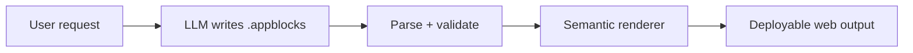

# AppBlocks Web

AppBlocks Web is an LLM-native language and zero-dependency compiler for complete websites and web applications. A model writes compact semantic blocks; AppBlocks expands them into responsive, accessible and interactive HTML, CSS and JavaScript.

```appblocks
site "Northstar" theme=signal
  header logo=Northstar sticky=true
    link "Product" href="/#product"
    button "Open workspace" href="/app/" variant=solid

  page "/" title="Northstar"
    hero variant=editorial
      eyebrow "Project direction, made visible"
      title "Turn requests into a plan your team can trust." level=1
      text "Keep decisions, owners and delivery risk in one view."
      button "Explore the workspace" href="/app/" variant=solid
      visual variant=dashboard
    features variant=bento
      feature icon=layers
        title "Decision records"
        text "Keep the why and the owner attached to every choice."
```

The compiler supplies semantic markup, responsive layout, design tokens, themes, navigation, focus states, reduced motion, safe escaping and browser behavior. The generated site runs without AppBlocks and without a frontend framework.

## Why this exists

Coding models repeatedly spend tokens recreating the same headers, hero layouts, buttons, responsive rules, form states, tables, dialogs and event handlers. AppBlocks moves that repeated implementation into tested contracts.



The model describes product-specific content, structure, data and exceptions. The compiler owns stable web plumbing.

## Current proof

The repository's own four-route showcase is written in [`examples/showcase.appblocks`](examples/showcase.appblocks). It instantiates 223 blocks across a marketing site, searchable catalog, language guide and interactive dashboard.

The current benchmark reports:

| Input | Exact source bytes | Exact generated bytes | Expansion |
| --- | ---: | ---: | ---: |
| `showcase.appblocks` | 14,237 | 163,132 | **11.46×** |

This measures exact UTF-8 byte expansion, not an invented tokenizer result. Build manifests also include a clearly labelled four-characters-per-token estimate. The meaningful product claim is that a model can emit the compact source instead of emitting the expanded implementation.

## Capabilities

- 81 machine-readable block contracts
- Multiple routes and shared site chrome
- Marketing, application, reading and showcase surfaces
- Headers, heroes, features, pricing, FAQ and calls to action
- Dashboards, metrics, charts, tables, forms, tabs, dialogs and boards
- Three style packs, each with light and dark modes, through semantic design tokens
- Keyboard navigation, focus visibility and reduced-motion handling
- Responsive layouts down to 320 CSS pixels by design contract
- Safe HTML escaping and executable-URL rejection
- Source-located diagnostics with nearest-block suggestions
- Build, development server, validation, inspection, catalog and token commands
- Dependency-free generated browser output

## Quick start

AppBlocks Web currently runs directly from this repository:

```bash
git clone https://github.com/spartandev49/app-blocks-web.git
cd app-blocks-web
node bin/appblocks.js validate examples/showcase.appblocks --strict
node bin/appblocks.js build examples/showcase.appblocks --out public
node bin/appblocks.js dev examples/showcase.appblocks
```

Open `http://127.0.0.1:4173`. The development server rebuilds and reloads after source changes.

Node.js 20 or newer is required. The compiler and generated output install no third-party packages.

## CLI

```text
appblocks build <file> [--out public] [--base /] [--strict]
appblocks dev <file> [--port 4173] [--host 127.0.0.1]
appblocks validate <file> [--strict] [--json]
appblocks inspect <file> [--json]
appblocks catalog [block] [--json]
appblocks tokens <file> [--json]
```

Useful model-facing calls:

```bash
node bin/appblocks.js catalog hero --json
node bin/appblocks.js catalog application --json
node bin/appblocks.js validate generated.appblocks --strict --json
```

A build writes:

```text
public/
├── index.html
├── <route>/index.html
├── appblocks.css
├── appblocks.js
├── appblocks.catalog.json
└── appblocks.manifest.json
```

## Using AppBlocks from JavaScript

```js
import { compile, writeBuild } from "app-blocks-web";

const result = await compile(source, {
  filename: "product.appblocks",
  strict: true
});

await writeBuild(result, "public");
console.log(result.manifest.output.expansionRatio);
```

## Writing with an LLM

Give the model [`LLMS.txt`](LLMS.txt), then let it retrieve only the relevant catalog contracts. A reliable instruction is:

> Write one valid AppBlocks Web file. Prefer the largest semantic block that matches the requested result. Specify content and meaningful exceptions; accept compiler defaults for responsive layout, states and accessibility. Do not emit raw HTML or JavaScript. Validate in strict mode and repair every diagnostic.

See [`docs/AUTHORING_FOR_LLMS.md`](docs/AUTHORING_FOR_LLMS.md) for the full workflow.

## Documentation

- [Language reference](docs/LANGUAGE.md)
- [Block-system guide](docs/BLOCKS.md)
- [Architecture](docs/ARCHITECTURE.md)
- [LLM authoring guide](docs/AUTHORING_FOR_LLMS.md)
- [Backend handoff](BACKEND_HANDOFF.md)
- [Security policy](SECURITY.md)

## Examples

- [`showcase.appblocks`](examples/showcase.appblocks): self-hosted product site, catalog, guide and dashboard
- [`saas.appblocks`](examples/saas.appblocks): marketing site plus application workspace
- [`portfolio.appblocks`](examples/portfolio.appblocks): editorial portfolio direction
- [`admin.appblocks`](examples/admin.appblocks): dense operational application

Every bundled example is compiled under strict validation in the test suite.

## Security model

AppBlocks has no raw-HTML or arbitrary-JavaScript block. User content is escaped, unsafe URL schemes are rejected and generated behavior comes from an allowlisted runtime. This reduces common model-generated vulnerabilities; it does not replace application-level authorization, backend validation, CSP or security review.

Read [SECURITY.md](SECURITY.md) before using generated output for sensitive applications.

## Deliberate boundaries

Version 0.1 is a static web compiler with local interaction behavior. It does not generate databases, production authentication, payments or server APIs. Those require explicit backend adapters rather than simulated integrations.

AppBlocks cannot compress irreducibly custom behavior. When no suitable block exists, add ordinary source after compilation or implement a reviewed block contract.

## Verification

```bash
node --test
node scripts/static-audit.js
node scripts/benchmark.js
node bin/appblocks.js build examples/showcase.appblocks --out public --strict
```

The static audit checks generated landmarks, heading count, duplicate IDs, skip links, inline handlers, executable URLs, runtime assets, reduced motion, focus treatment and dynamic-code evaluation. Browser rendering still requires an installed browser and is tracked separately in `DEMO_CONTRACT.json`.

## Repository policy

The public repository is maintained by `spartandev49`. No outside account receives write access. See [CONTRIBUTING.md](CONTRIBUTING.md) for the maintainer-only upstream policy.

## License

[MIT](LICENSE). Public visibility and an open-source license permit reading, use and forks; they do not grant write access to this repository.
