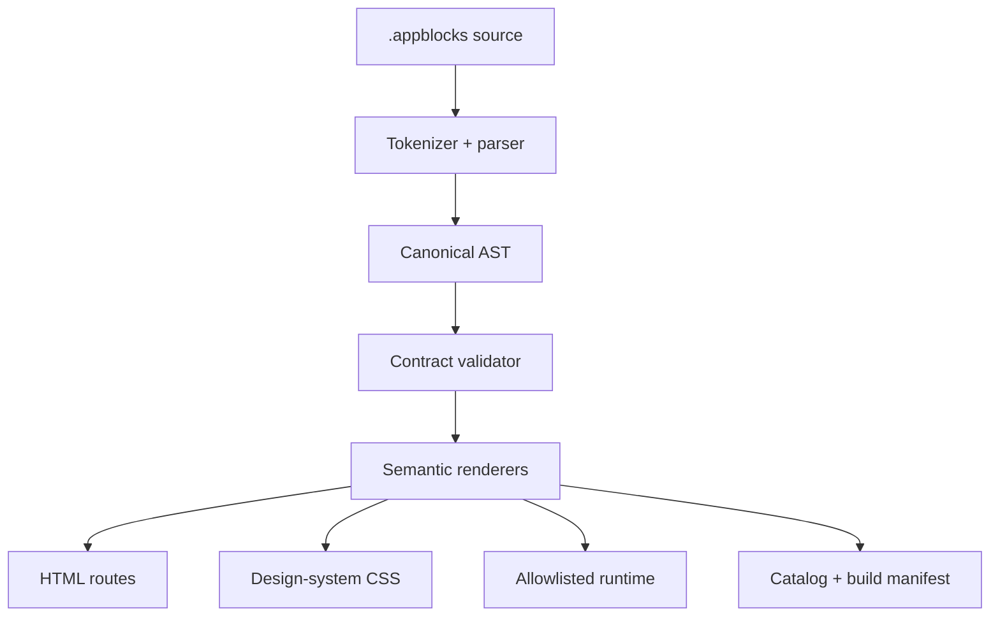

# Architecture

AppBlocks Web separates model-authored intent from browser implementation.

## Modules

| Module | Responsibility |
| --- | --- |
| `tokenize.js` | Comments, quoted strings, collections and typed values |
| `parser.js` | Two-space hierarchy and source-located canonical nodes |
| `catalog.js` | Stable machine-readable block contracts |
| `validate.js` | Structural, contract, accessibility and URL checks |
| `render-*.js` | Semantic markup for content, marketing and applications |
| `appblocks.css` | Tokens, style packs, responsive layout and visual states |
| `runtime.js` | Navigation, themes, reveals, copy, dialogs, tabs, filters, table sorting and local demo forms |
| `compiler.js` | Route generation, asset packaging and deterministic manifests |
| `bin/appblocks.js` | Build, development, validation, inspection and catalog commands |

## Why static output

The first renderer targets standard browser files instead of React or another framework because the output must:

- deploy to any static host;
- remain inspectable without compiler tooling;
- avoid transferring framework syntax back into the model's task;
- provide useful marketing, reading and application surfaces from one target;
- keep generated runtime dependencies at zero.

A future renderer may target a framework without changing the authoring language or canonical AST.

## Compiler stages

### Parse

The parser does not guess malformed structure. Tabs, odd indentation, unterminated quotes, invalid names and malformed collections produce source-located errors.

### Validate

Validation happens before any file is written. Unknown blocks, unsafe URLs, duplicate routes, missing field labels and missing image alternatives fail the build. Strict mode promotes unknown attributes from warnings to errors.

### Render

Renderers receive validated nodes and escape every authored string. Structural decisions such as heading tags, navigation landmarks, button/link semantics, labels and table scopes are deterministic.

### Package

The compiler emits route files, one CSS asset, one runtime module, the installed catalog and a build manifest. It removes only stale files listed in the previous AppBlocks manifest; it never clears an arbitrary output directory.

## Security posture

The DSL is intentionally not Turing-complete and exposes no arbitrary code execution. Behavioral attributes select allowlisted runtime operations. Text is escaped, class tokens are filtered and unsafe URL protocols fail validation.

This architecture reduces syntax hallucination and injection surface. It cannot establish authorization or validate remote data because those boundaries do not exist in the static compiler.

## Extending the catalog

A new upstream block currently requires four coherent changes:

1. Add its manifest to `catalog.js`.
2. Add semantic rendering in the matching renderer.
3. Add tokenized visual and interaction treatment.
4. Add a strict-compiling example plus a behavior or output test.

A block is not accepted merely because it renders. It must own a recognizable job, define content extremes and interaction states, remain responsive and provide a materially smaller model representation than manual composition.

## Determinism and generated-file ownership

The `.appblocks` source is authoritative. Generated files are disposable outputs. Edit generated files only when deliberately using the conventional-code escape hatch, and record that boundary because the next build may replace compiler-owned files.
